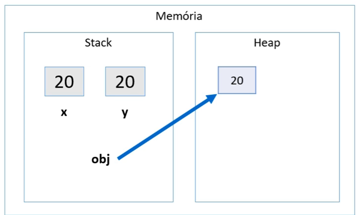

```markdown
# **Sumário Interativo**

- [1. Arrays](#1-arrays)
  - [1.1 Motivação](#11-motivação)
  - [1.2 Declaração e Instanciação](#12-declaração-e-instanciação)
  - [1.3 Populando e Percorrendo Arrays](#13-populando-e-percorrendo-arrays)
    - [1.3.1 For Tradicional](#131-for-tradicional)
    - [1.3.2 Propriedade length](#132-propriedade-length)
    - [1.3.3 Enhanced for (Java 5+)](#133-enhanced-for-java-5)
  - [1.4 Arrays de Tipos Primitivos vs. Arrays de Objetos](#14-arrays-de-tipos-primitivos-vs-arrays-de-objetos)
    - [1.4.1 Arrays de Tipos Primitivos](#141-arrays-de-tipos-primitivos)
    - [1.4.2 Arrays de Objetos (Referências)](#142-arrays-de-objetos-referências)
  - [1.5 Arrays com Herança](#15-arrays-com-herança)
  - [1.6 Tamanho Fixo e Redimensionamento](#16-tamanho-fixo-e-redimensionamento)

- [2. Memória em Arrays de Java](#2-memória-em-arrays-de-java)
  - [2.1 Stack e Heap](#21-stack-e-heap)
  - [2.2 Organização da Memória](#22-organização-da-memória)
  - [2.3 Exemplo Visual](#23-exemplo-visual)

- [3. Boxing, Unboxing e Wrapper Classes em Java](#3-boxing-unboxing-e-wrapper-classes-em-java)
  - [3.1 Introdução](#31-introdução)
  - [3.2 Boxing](#32-boxing)
  - [3.3 Unboxing](#33-unboxing)
  - [3.4 Wrapper Classes](#34-wrapper-classes)
  - [3.5 Exemplo Prático](#35-exemplo-prático)
  - [3.6 Exemplo com Classes e Uso em Sistemas de Informação](#36-exemplo-com-classes-e-uso-em-sistemas-de-informação)
  - [3.7 Resumo](#37-resumo)

- [4. Laço \"for each\"](#4-laço-for-each)
  - [4.1 Introdução](#41-introdução)
  - [4.2 Sintaxe](#42-sintaxe)
  - [4.3 Diferença entre for Tradicional e for each](#43-diferença-entre-for-tradicional-e-for-each)
  - [4.4 Exemplos Práticos](#44-exemplos-práticos)
  - [4.5 Limitações do for each](#45-limitações-do-for-each)
  - [4.6 Conclusão](#46-conclusão)

---

# 1. Arrays
## 1.1 Motivação

Em Java, **arrays** são estruturas homogêneas (mesmo tipo) que armazenam diversos elementos usando uma única referência. São **contíguos na memória**, de **tamanho fixo** e **indexados** a partir de 0.

<br>


Sem arrays, teríamos que armazenar dados em várias variáveis separadas:
```java
double saldoConta1 = conta1.getSaldo();
double saldoConta2 = conta2.getSaldo();
double saldoConta3 = conta3.getSaldo();
```
Isso é pouco prático. Com arrays, unificamos as variáveis em uma única estrutura.

---

## 1.2 Declaração e Instanciação

Para usar arrays:
1. **Declarar** a variável de array, informando o tipo dos elementos.
2. **Instanciar** o objeto array, definindo quantas posições ele terá.

### Exemplo de Array de `double`
```java
double[] saldosDasContas;          // Declaração
saldosDasContas = new double[10];  // Instancia 10 posições (índices 0 a 9)
```
- `saldosDasContas` é uma **referência** a um objeto array de `double`.
- Cada posição começa com valor **0.0**.

### Acessando Elementos
```java
saldosDasContas[0] = 1000.0;
saldosDasContas[5] = 500.0;
System.out.println(saldosDasContas[5]); // 500.0
```
> **Atenção:** Índices inválidos (ex.: `saldosDasContas[10]`) geram `ArrayIndexOutOfBoundsException`.

---

## 1.3 Populando e Percorrendo Arrays

### 1.3.1 For Tradicional
Se o array tiver 10 posições, elas vão de `0` a `9`:
```java
int[] idades = new int[10];

// Atribuindo valores
for (int i = 0; i < 10; i++) {
    idades[i] = i * 10;
}

// Exibindo valores
for (int i = 0; i < 10; i++) {
    System.out.println(idades[i]);
}
```

### 1.3.2 Propriedade length
Use `array.length` para obter o tamanho do array, evitando valores “hard-coded”:
```java
for (int i = 0; i < idades.length; i++) {
    System.out.println(idades[i]);
}
```

### 1.3.3 Enhanced for (Java 5+)
Forma simplificada de iterar quando o índice não é necessário:
```java
for (int valor : idades) {
    System.out.println(valor);
}
```

---

## 1.4 Arrays de Tipos Primitivos vs. Arrays de Objetos

### 1.4.1 Arrays de Tipos Primitivos
Cada posição guarda diretamente o valor:
```java
int[] numeros = new int[3];
numeros[0] = 10;
numeros[1] = 20;
numeros[2] = 30;
```

### 1.4.2 Arrays de Objetos (Referências)
Cada posição armazena uma **referência** a um objeto na **Heap**. Antes de atribuir, é `null`.

```java
ContaCorrente[] minhasContas = new ContaCorrente[10];
minhasContas[0] = new ContaCorrente();
minhasContas[0].deposita(1000.0);
```
> Se tentarmos `minhasContas[1].getSaldo()` sem atribuir um objeto, ocorre `NullPointerException`.


---

## 1.5 Arrays com Herança
Podemos usar um array do tipo da classe-mãe (`Conta`) para armazenar subclasses:
```java
Conta[] contas = new Conta[10];
contas[0] = new ContaCorrente();
contas[1] = new ContaPoupanca();
```
Cada posição guarda uma referência que aponta para um tipo específico de `Conta`.

---

## 1.6 Tamanho Fixo e Redimensionamento

O tamanho do array é definido ao criar com `new`. Para “aumentar”:
1. Crie um novo array maior.
2. Copie os elementos do array antigo.
3. Atribua a nova referência.

```java
int[] numeros = new int[5];
int[] numerosMaior = new int[10];

for (int i = 0; i < numeros.length; i++) {
    numerosMaior[i] = numeros[i];
}

numeros = numerosMaior;
```
> Em muitos casos, preferimos estruturas de **coleção** (ex.: `ArrayList`, `HashSet`) que crescem dinamicamente.

---

# 2. Memória em Arrays de Java

## 2.1 Stack e Heap

- **Stack:**  
  Armazena variáveis locais e referências (incluindo a referência do array e o tamanho).

- **Heap:**  
  Armazena o **array em si** (com suas posições) e os **objetos** que cada posição referência.

---

## 2.2 Organização da Memória

### Referências no Array


Cada posição em um array de objetos aponta para um objeto na Heap ou permanece `null`.

```java
Conta[] contas = new Conta[3];
contas[0] = new Conta();
contas[1] = new Conta();
contas[2] = null;
```
**Visão de Memória:**
- **Stack:** mantém a variável `contas` (referência ao array) e as variáveis locais.
- **Heap:** contém o array `contas` (3 posições) e os objetos `Conta`.

---

## 2.3 Exemplo Visual

```plaintext
Stack:                 Heap:
contas  ---------->  [Ref0, Ref1, null]
Ref0  ------------>   Objeto Conta (#1)
Ref1  ------------>   Objeto Conta (#2)
```

---

# 3. Boxing, Unboxing e Wrapper Classes em Java

## 3.1 Introdução
Em Java, existem dois tipos de dados principais:
- **Tipos primitivos:** Dados simples como `int`, `double`, `char`, `boolean`, entre outros.
- **Tipos referência:** Objetos e instâncias de classes.

Por padrão, os tipos primitivos são mais eficientes em termos de desempenho e memória, mas não oferecem os recursos da Programação Orientada a Objetos (POO). Para trabalhar com esses recursos, o Java disponibiliza as **wrapper classes**, que encapsulam tipos primitivos em objetos.

---

## 3.2 Boxing

### O que é?
O **Boxing** é o processo de conversão automática de um **tipo primitivo** para o seu **tipo referência correspondente** (ou seja, uma **wrapper class**). Isso permite que tipos primitivos sejam tratados como objetos.

### Como funciona na memória?

- **Stack:** Armazena variáveis locais e referências.
- **Heap:** Armazena objetos e instâncias.


No exemplo acima:
- `x` (20) está armazenado na **Stack**.
- `obj` é uma referência que aponta para um objeto `Integer` armazenado na **Heap**, que contém o valor 20.

### Quando é usado?
- Ao adicionar tipos primitivos em coleções que aceitam apenas objetos (ex.: `ArrayList<Integer>`).
- Ao passar tipos primitivos para métodos que exigem objetos.
- Quando precisamos usar recursos da orientação a objetos com tipos primitivos.

---

## 3.3 Unboxing

### O que é?
O **Unboxing** é o processo inverso do boxing: converte um **objeto wrapper** de volta para o seu **tipo primitivo** correspondente.

### Como funciona na memória?

- `obj` aponta para um objeto `Integer` na Heap com valor 20.
- `y` recebe o valor primitivo 20 da Stack.

**Representação na memória:**



### Quando é usado?
- Ao realizar operações aritméticas com wrapper classes.
- Ao acessar valores em coleções e atribuí-los a tipos primitivos.
- Ao passar objetos para métodos que exigem tipos primitivos.

---

## 3.4 Wrapper Classes
As **wrapper classes** são classes que encapsulam tipos primitivos em objetos, permitindo que sejam usados em contextos que exigem objetos.

| Tipo Primitivo | Wrapper Class |
|----------------|---------------|
| `byte`         | `Byte`        |
| `short`        | `Short`       |
| `int`          | `Integer`     |
| `long`         | `Long`        |
| `float`        | `Float`       |
| `double`       | `Double`      |
| `char`         | `Character`   |
| `boolean`      | `Boolean`     |

### Por que usar Wrapper Classes?
- **Trabalhar com coleções:** Coleções como `ArrayList`, `HashMap` e outras só aceitam tipos referência, não tipos primitivos.
- **Permitir valores `null`:** Diferente dos tipos primitivos, os objetos podem ter valor `null`.
- **Utilizar métodos úteis:** Wrapper classes oferecem métodos para conversões e manipulações.

---

## 3.5 Exemplo Prático
```java
public class Demo {
    public static void main(String[] args) {
        Integer x = 10;          // Boxing: int -> Integer
        int y = x * 2;           // Unboxing automático para multiplicação

        System.out.println("Valor de x (Integer): " + x);
        System.out.println("Resultado de y (int): " + y);
    }
}
```
Saída:
```
Valor de x (Integer): 10
Resultado de y (int): 20
```

---

## 3.6 Exemplo com Classes e Uso em Sistemas de Informação

```java
public class Product {
    public String name;
    public Double price;      // Wrapper permite null
    public Integer quantity;  // Wrapper usado para aceitar valores nulos

    public Product(String name, Double price, Integer quantity) {
        this.name = name;
        this.price = price;
        this.quantity = quantity;
    }

    public double totalPrice() {
        return price * quantity;  // Unboxing automático
    }
}
```

Exemplo de uso:
```java
public class DemoProduct {
    public static void main(String[] args) {
        Product p = new Product("Laptop", 1500.00, 2);
        System.out.println("Total: " + p.totalPrice());
    }
}
```
```
Total: 3000.0
```
---

## 3.7 Resumo
- **Boxing:** Converte tipos primitivos em objetos (ex.: `int` → `Integer`).
- **Unboxing:** Converte objetos wrapper em tipos primitivos (ex.: `Integer` → `int`).
- **Wrapper Classes:** Permitem usar tipos primitivos como objetos e aproveitar recursos de coleções, permitir `null` e métodos adicionais.

---

# 4. Laço "for each"

## 4.1 Introdução
O laço **"for each"** é uma forma simplificada de percorrer **arrays** e **coleções** em Java, especialmente quando não precisamos do índice.

## 4.2 Sintaxe
```java
for (Tipo elemento : coleção) {
    // comandos
}
```

## 4.3 Diferença entre for Tradicional e for each

### Exemplo com `for` tradicional:
```java
String[] nomes = {"Maria", "Bob", "Alex"};

for (int i = 0; i < nomes.length; i++) {
    System.out.println(nomes[i]);
}
```

### Exemplo com `for each`:
```java
for (String nome : nomes) {
    System.out.println(nome);
}
```
---

## 4.4 Exemplos Práticos

```java
int[] numeros = {1, 2, 3, 4, 5};
for (int numero : numeros) {
    System.out.println(numero);
}
```

Saída:
```
1
2
3
4
5
```
---

## 4.5 Limitações do for each
- Não permite acessar o **índice** atual facilmente.
- Não é possível **remover elementos** durante a iteração.
- Não permite **alterar diretamente** o valor de elementos primitivos.

---

## 4.6 Conclusão
- O laço **`for each`** simplifica a leitura de arrays e coleções.
- Use quando não precisar do índice.
- Para manipulações que exijam índice, use o `for` tradicional.

```
```