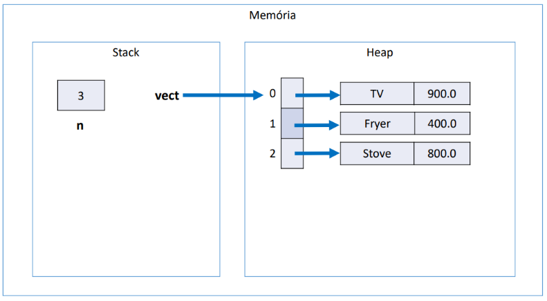
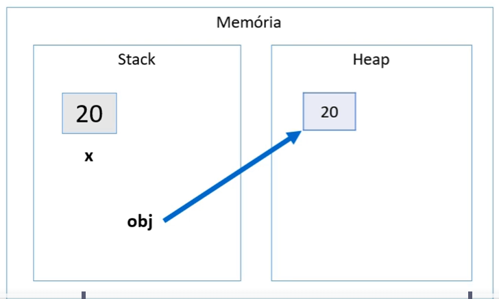
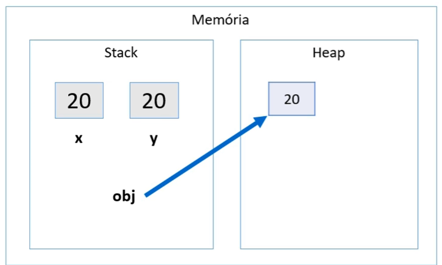
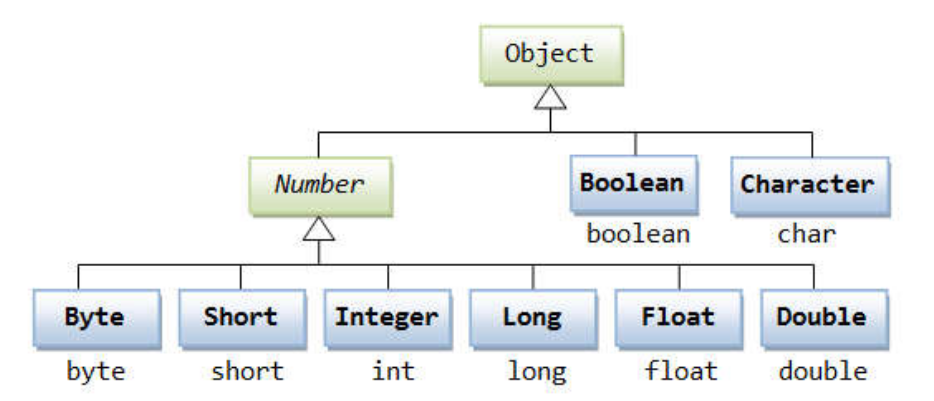

# **Sumário Interativo**

- [Arrays](#arrays)
  - [1. Motivação](#1-motivação)
  - [2. Declaração e Instanciação](#2-declaração-e-instanciação)
  - [3. Populando e Percorrendo Arrays](#3-populando-e-percorrendo-arrays)
    - [3.1 For Tradicional](#31-for-tradicional)
    - [3.2 Propriedade length](#32-propriedade-length)
    - [3.3 Enhanced for (Java 5+)](#33-enhanced-for-java-5)
  - [4. Arrays de Tipos Primitivos vs. Arrays de Objetos](#4-arrays-de-tipos-primitivos-vs-arrays-de-objetos)
    - [4.1 Arrays de Tipos Primitivos](#41-arrays-de-tipos-primitivos)
    - [4.2 Arrays de Objetos (Referências)](#42-arrays-de-objetos-referências)
  - [5. Arrays com Herança](#5-arrays-com-herança)
  - [6. Tamanho Fixo e Redimensionamento](#6-tamanho-fixo-e-redimensionamento)

- [Memória em Arrays de Java](#memória-em-arrays-de-java)
  - [1. Stack e Heap](#1-stack-e-heap)
  - [2. Organização da Memória](#2-organização-da-memória)
  - [3. Exemplo Visual](#3-exemplo-visual)

- [Boxing, Unboxing e Wrapper Classes em Java](#boxing-unboxing-e-wrapper-classes-em-java)
  - [Introdução](#introdução)
  - [1. Boxing](#1-boxing)
  - [2. Unboxing](#2-unboxing)
  - [3. Wrapper Classes](#3-wrapper-classes)
  - [4. Exemplo Prático](#4-exemplo-prático)
  - [5. Exemplo com Classes e Uso Prático em Sistemas de Informação](#5-exemplo-com-classes-e-uso-prático-em-sistemas-de-informação)
  - [6. Resumo](#6-resumo)

- [Laço "for each"](#laço-for-each)
  - [Introdução](#introdução-1)
  - [Sintaxe](#sintaxe)
  - [Exemplo com `for` Tradicional:](#exemplo-com-for-tradicional)
  - [Exemplo com `for each`:](#exemplo-com-for-each)
  - [Exemplos Práticos](#exemplos-práticos)
  - [Limitações do `for each`](#limitações-do-for-each)
  - [Conclusão](#conclusão)

---

# Arrays
## 1. Motivação

Em Java, **arrays** são estruturas homogêneas (mesmo tipo) que armazenam diversos elementos usando uma única referência. São **contíguos na memória**, de **tamanho fixo** e **indexados** a partir de 0.

<br>


---

Sem arrays, teríamos que armazenar dados em várias variáveis separadas:
```java
double saldoConta1 = conta1.getSaldo();
double saldoConta2 = conta2.getSaldo();
double saldoConta3 = conta3.getSaldo();
```
Isso é pouco prático. Com arrays, unificamos as variáveis em uma única estrutura.

<br>

---

## 2. Declaração e Instanciação
Para usar arrays:
1. **Declarar** a variável de array, informando o tipo dos elementos.
2. **Instanciar** o objeto array, definindo quantas posições ele terá.

### Exemplo de Array de `double`
```java
double[] saldosDasContas;          // Declaração
saldosDasContas = new double[10];  // Instancia 10 posições (índices 0 a 9)
```
- `saldosDasContas` é uma **referência** a um objeto array de `double`.
- Cada posição começa com valor **0.0**.

### Acessando Elementos
```java
saldosDasContas[0] = 1000.0;
saldosDasContas[5] = 500.0;
System.out.println(saldosDasContas[5]); // 500.0
```
> **Atenção:** Índices inválidos (ex.: `saldosDasContas[10]`) geram `ArrayIndexOutOfBoundsException`.

<br>

---

## 3. Populando e Percorrendo Arrays

### 3.1 For Tradicional
Se o array tiver 10 posições, elas vão de `0` a `9`:
```java
int[] idades = new int[10];

// Atribuindo valores
for (int i = 0; i < 10; i++) {
    idades[i] = i * 10;
}

// Exibindo valores
for (int i = 0; i < 10; i++) {
    System.out.println(idades[i]);
}
```

### 3.2 Propriedade length
Use `array.length` para obter o tamanho do array, evitando valores “hard-coded”:
```java
for (int i = 0; i < idades.length; i++) {
    System.out.println(idades[i]);
}
```

### 3.3 Enhanced for (Java 5+)
Forma simplificada de iterar quando o índice não é necessário:
```java
for (int valor : idades) {
    System.out.println(valor);
}
```

<br>

---

## 4. Arrays de Tipos Primitivos vs. Arrays de Objetos

### 4.1 Arrays de Tipos Primitivos
Cada posição guarda diretamente o valor:
```java
int[] numeros = new int[3];
numeros[0] = 10;
numeros[1] = 20;
numeros[2] = 30;
```

### 4.2 Arrays de Objetos (Referências)
Cada posição armazena uma **referência** a um objeto na **Heap**. Antes de atribuir, é `null`.

```java
ContaCorrente[] minhasContas = new ContaCorrente[10];
minhasContas[0] = new ContaCorrente();
minhasContas[0].deposita(1000.0);
```
> Se tentarmos `minhasContas[1].getSaldo()` sem atribuir um objeto, ocorre `NullPointerException`.


<br>

---

## 5. Arrays com Herança
Podemos usar um array do tipo da classe-mãe (`Conta`) para armazenar subclasses:
```java
Conta[] contas = new Conta[10];
contas[0] = new ContaCorrente();
contas[1] = new ContaPoupanca();
```
Cada posição guarda uma referência que aponta para um tipo específico de `Conta`.

<br>

---

## 6. Tamanho Fixo e Redimensionamento

O tamanho do array é definido ao criar com `new`. Para “aumentar”:
1. Crie um novo array maior.
2. Copie os elementos do array antigo.
3. Atribua a nova referência.

```java
int[] numeros = new int[5];
int[] numerosMaior = new int[10];

for (int i = 0; i < numeros.length; i++) {
    numerosMaior[i] = numeros[i];
}

numeros = numerosMaior;
```
> Em muitos casos, preferimos estruturas de **coleção** (ex.: `ArrayList`, `HashSet`) que crescem dinamicamente.

<br>

---

# Memória em Arrays de Java

## 1. Stack e Heap
- **Stack:**  
  Armazena variáveis locais e referências (incluindo a referência do array e o tamanho).

- **Heap:**  
  Armazena o **array em si** (com suas posições) e os **objetos** que cada posição referência.

---

## 2. Organização da Memória

### Referências no Array



Cada posição em um array de objetos aponta para um objeto na Heap ou permanece `null`.

```java
Conta[] contas = new Conta[3];
contas[0] = new Conta();
contas[1] = new Conta();
contas[2] = null;
```
**Visão de Memória:**
- **Stack:** mantém a variável `contas` (referência ao array) e as variáveis locais.
- **Heap:** contém o array `contas` (3 posições) e os objetos `Conta`.

---

## 3. Exemplo Visual

```plaintext
Stack:                 Heap:
contas  ---------->  [Ref0, Ref1, null]
Ref0  ------------>   Objeto Conta (#1)
Ref1  ------------>   Objeto Conta (#2)
```

---

# **Boxing, Unboxing e Wrapper Classes em Java**

## **Introdução**
Em Java, existem dois tipos de dados principais:
- **Tipos primitivos:** Dados simples como `int`, `double`, `char`, `boolean`, entre outros.
- **Tipos referência:** Objetos e instâncias de classes.

Por padrão, os tipos primitivos são mais eficientes em termos de desempenho e memória, mas não oferecem os recursos da Programação Orientada a Objetos (POO). Para trabalhar com esses recursos, o Java disponibiliza as **wrapper classes**, que encapsulam tipos primitivos em objetos.

---

## **1. Boxing**

### **O que é?**
O **Boxing** é o processo de conversão automática de um **tipo primitivo** para o seu **tipo referência correspondente** (ou seja, uma **wrapper class**). Isso permite que tipos primitivos sejam tratados como objetos.

### **Como funciona na memória?**
- **Stack:** Armazena variáveis locais e referências.
- **Heap:** Armazena objetos e instâncias.




No exemplo acima:
- `x` (20) está armazenado na **Stack**.
- `obj` é uma referência que aponta para um objeto `Integer` armazenado na **Heap**, que contém o valor 20.

### **Quando é usado?**
- Ao adicionar tipos primitivos em coleções que aceitam apenas objetos (ex.: `ArrayList<Integer>`).
- Ao passar tipos primitivos para métodos que exigem objetos.
- Quando precisamos usar recursos da orientação a objetos com tipos primitivos.

---

## **2. Unboxing**

### **O que é?**
O **Unboxing** é o processo inverso do boxing: converte um **objeto wrapper** de volta para o seu **tipo primitivo** correspondente.

### **Como funciona na memória?**
- `obj` aponta para um objeto `Integer` na Heap com valor 20.
- `y` recebe o valor primitivo 20 da Stack.

**Representação na memória:**




### **Quando é usado?**
- Ao realizar operações aritméticas com wrapper classes.
- Ao acessar valores em coleções e atribuí-los a tipos primitivos.
- Ao passar objetos para métodos que exigem tipos primitivos.

---

## **3. Wrapper Classes**
As **wrapper classes** são classes que encapsulam tipos primitivos em objetos, permitindo que sejam usados em contextos que exigem objetos.



### **Principais Wrapper Classes em Java:**

| Tipo Primitivo | Wrapper Class |
|----------------|---------------|
| `byte`         | `Byte`        |
| `short`        | `Short`       |
| `int`          | `Integer`     |
| `long`         | `Long`        |
| `float`        | `Float`       |
| `double`       | `Double`      |
| `char`         | `Character`   |
| `boolean`      | `Boolean`     |

### **Por que usar Wrapper Classes?**
- **Trabalhar com coleções:** Coleções como `ArrayList`, `HashMap`, e outras só aceitam tipos referência, não tipos primitivos.
- **Permitir valores `null`:** Diferente dos tipos primitivos, os objetos podem ter valor `null`, útil para representar valores indefinidos.
- **Utilizar métodos úteis:** Wrapper classes oferecem métodos que facilitam conversões e manipulações.

---

## **4. Exemplo Prático: Uso de Wrapper Classes com Boxing e Unboxing**

### **Código exemplo:**
```java
public class Demo {
    public static void main(String[] args) {
        Integer x = 10;          // Boxing: int -> Integer
        int y = x * 2;           // Unboxing automático para multiplicação

        System.out.println("Valor de x (Integer): " + x);
        System.out.println("Resultado de y (int): " + y);
    }
}
```

**Saída:**
```
Valor de x (Integer): 10
Resultado de y (int): 20
```

### **Explicação:**
- `Integer x = 10;`: O valor primitivo `10` é automaticamente convertido em um objeto `Integer` (**Boxing**).
- `int y = x * 2;`: O objeto `x` é convertido de volta para o tipo primitivo `int` para realizar a multiplicação (**Unboxing**).

---

## **5. Exemplo com Classes e Uso Prático em Sistemas de Informação**

Em aplicações reais, como sistemas de cadastro ou e-commerce, é comum usar wrapper classes em atributos de classes para permitir valores nulos e aproveitar recursos da POO.

### **Exemplo com uma classe `Product`:**
```java
public class Product {
    public String name;
    public Double price;      // Wrapper permite null e métodos adicionais
    public Integer quantity;  // Wrapper usado para aceitar valores nulos

    public Product(String name, Double price, Integer quantity) {
        this.name = name;
        this.price = price;
        this.quantity = quantity;
    }

    public double totalPrice() {
        return price * quantity;  // Unboxing automático ocorre aqui
    }
}
```

### **Uso da classe:**
```java
public class DemoProduct {
    public static void main(String[] args) {
        Product p = new Product("Laptop", 1500.00, 2);
        System.out.println("Total: " + p.totalPrice());
    }
}
```

**Saída:**
```
Total: 3000.0
```

### **Por que usar `Double` e `Integer` em vez de `double` e `int`?**
- **Permitir `null`:** Se o preço ou a quantidade ainda não forem definidos, podemos atribuir `null`, algo impossível com tipos primitivos.
- **Integração com frameworks:** Bibliotecas de persistência de dados (como JPA) exigem tipos referência para mapear colunas do banco de dados que aceitam `null`.

---

## **6. Resumo**

- **Boxing:** Converte tipos primitivos em objetos (ex.: `int` → `Integer`).
- **Unboxing:** Converte objetos wrapper em tipos primitivos (ex.: `Integer` → `int`).
- **Wrapper Classes:** Permitem usar tipos primitivos como objetos, fundamentais para trabalhar com coleções, permitir `null` e utilizar métodos adicionais.

---

<br>

# **Laço "for each"**

## **Introdução**
O laço **"for each"** é uma estrutura de repetição em Java que oferece uma forma **simplificada e legível** para percorrer elementos de **coleções** e **arrays**. Ele é especialmente útil quando você deseja acessar todos os elementos de uma coleção **sem se preocupar com índices**.

## **Sintaxe**
```java
for (Tipo elemento : coleção) {
    // comandos a serem executados para cada elemento
}
```
- **Tipo:** Tipo dos elementos da coleção ou array.
- **elemento:** Nome da variável que representará cada item da coleção em cada iteração.
- **coleção:** Estrutura de dados a ser percorrida (array, `ArrayList`, `Set`, entre outros).

## **Exemplo com `for` Tradicional:**
```java
String[] nomes = {"Maria", "Bob", "Alex"};

for (int i = 0; i < nomes.length; i++) {
    System.out.println(nomes[i]);
}
```
- O `for` tradicional usa um **índice** para acessar elementos.
- Você precisa gerenciar o índice `i` e verificar a condição de parada `i < nomes.length`.

---

## **Exemplo com `for each`:**
```java
String[] nomes = {"Maria", "Bob", "Alex"};

for (String nome : nomes) {
    System.out.println(nome);
}
```
- **Leitura:** "Para cada `String nome` em `nomes`, execute o bloco de código."
- Mais **limpo** e **legível**, sem necessidade de gerenciar índices.
- Menor chance de erros como **`ArrayIndexOutOfBoundsException`**.

---

## **Exemplos Práticos**
```java
int[] numeros = {1, 2, 3, 4, 5};

for (int numero : numeros) {
    System.out.println(numero);
}
```
Saída:
```
1
2
3
4
5
```
---

## **Limitações do `for each`**
- Não permite acessar o **índice** atual diretamente. Se precisar do índice, use o `for` tradicional.
- Não é possível **remover elementos** de uma coleção enquanto a percorre (use iteradores para isso).
- Não permite **alterar diretamente** os valores dos elementos primitivos em arrays.

---

## **Conclusão**
- O laço **`for each`** é ideal para **percorrer coleções e arrays** de forma **simples e legível**.  
- **Use o `for each`** quando não precisar de um índice ou modificar diretamente a coleção.  
- **Use o `for` tradicional** quando for necessário acessar o índice, modificar valores ou ter mais controle sobre a iteração.

