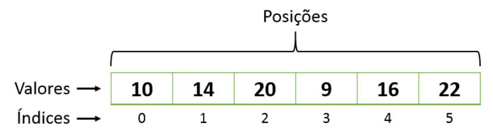
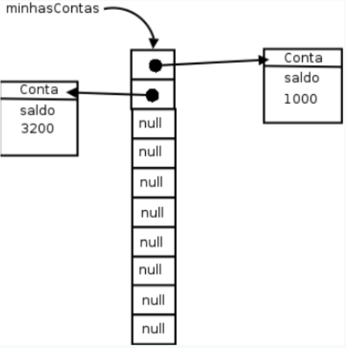

# Arrays em Java

## ** Introdução**
Em Java, arrays são estruturas que permitem armazenar várias variáveis (de mesmo tipo) em uma única referência. Eles têm **tamanho fixo**, e cada elemento é acessado por meio de um índice.

Neste tópico, veremos:
- Declaração e instanciação de arrays.
- Como preencher (popular) e percorrer arrays.
- Arrays de tipos primitivos e de referências (objetos).
- Boas práticas e exercícios para consolidar os conceitos.

<br>



---

## **Declaração e Instanciação**
Para usar um array em Java, você precisa:
1. **Declarar** uma variável de array, especificando o tipo de elemento que ele armazenará.
2. **Instanciar** (criar) o objeto array, definindo seu tamanho (número de elementos).

### **Exemplo de Array de `double`**
```java
double[] saldosDasContas;  // Declaração: array de double
saldosDasContas = new double[10];  // Instanciação: 10 posições (índices 0 a 9)
```

- `saldosDasContas` é uma variável de referência para um objeto array de `double`.
- Após `new double[10]`, esse array terá **10 elementos**, cada um inicialmente com valor `0.0`.

### **Acessando Elementos**
Podemos ler e escrever os elementos usando o índice (começando em 0):

```java
saldosDasContas[0] = 1000.0;   
saldosDasContas[5] = 500.0;    
System.out.println(saldosDasContas[5]); // Imprime: 500.0
```

⚠️ **Cuidado:** Tentar acessar um índice inválido (ex.: `saldosDasContas[10]`) resulta em uma **`ArrayIndexOutOfBoundsException`** em tempo de execução.

---

## ** Populando e Percorrendo Arrays**

### ** Percorrendo com `for` Tradicional**
Se criarmos um array de tamanho 10, podemos percorrê-lo com índices de 0 até 9:

```java
int[] idades = new int[10];

// Preenche o array
for (int i = 0; i < 10; i++) {
    idades[i] = i * 10;
}

// Imprime os elementos
for (int i = 0; i < 10; i++) {
    System.out.println(idades[i]);
}
```

---

### **`array.length`**
A propriedade `length` de um array indica seu tamanho (quantidade de elementos). Isso evita escrever números fixos (hard-coded):

```java
for (int i = 0; i < idades.length; i++) {
    System.out.println(idades[i]);
}
```

---

### **Percorrendo com o Enhanced `for` (Java 5+)**
O chamado “**for aprimorado**” simplifica o acesso aos elementos quando não precisamos do índice:

```java
for (int valor : idades) {
    System.out.println(valor);
}
```

> Internamente, o enhanced `for` é apenas uma forma mais simples de iterar sobre todos os elementos.

---

## **Arrays de Tipos Primitivos vs. Arrays de Objetos**

### **4.1 Arrays de Tipos Primitivos**
Cada posição armazena diretamente um valor primitivo.

```java
int[] numeros = new int[3];
numeros[0] = 10;
numeros[1] = 20;
numeros[2] = 30;
```

---

### **4.2 Arrays de Objetos (Referências)**
Quando declaramos um array de objetos, cada posição armazena uma **referência**. Antes de atribuir um objeto, ela contém `null`.

```java
ContaCorrente[] minhasContas;
minhasContas = new ContaCorrente[10];
```

- Neste ponto, nenhuma `ContaCorrente` foi criada ainda. O array contém **10 referências nulas**.



**Exemplo:**
```java
minhasContas[0] = new ContaCorrente();
minhasContas[0].deposita(1000.0);
System.out.println(minhasContas[0].getSaldo()); // 1000.0
```

⚠️ **Cuidado:** Tentar acessar `minhasContas[1]` antes de atribuir um objeto resultará em uma **`NullPointerException`**.

---

### **4.3 Arrays com Herança**
Podemos armazenar diferentes tipos de conta (ex.: `ContaCorrente`, `ContaPoupanca`) em um array do tipo da classe-mãe ou interface, permitindo armazenar subclasses:

```java
Conta[] contas = new Conta[10];
contas[0] = new ContaCorrente();
contas[1] = new ContaPoupanca();
```

---

## **5. Tamanho Fixo e Redimensionamento**
O tamanho de um array é fixo e definido no momento da criação. Para "redimensionar", você deve criar um novo array maior e copiar os valores do array antigo.

### **Exemplo:**
```java
int[] numeros = new int[5];

// Criar um novo array maior
int[] numerosMaior = new int[10];

// Copiar elementos
for (int i = 0; i < numeros.length; i++) {
    numerosMaior[i] = numeros[i];
}

// Substituir a referência
numeros = numerosMaior;
```

> Em aplicações modernas, é comum usar coleções como `ArrayList` ou `HashSet`, que se ajustam dinamicamente, ao invés de manipular arrays diretamente.

---

# Memória em Arrays de Java

Em Java, **arrays com referência a objetos** utilizam memória de forma dividida entre a **stack** e a **heap**. Essa separação é essencial para compreender como a linguagem gerencia objetos e arrays dinamicamente.

---

## **1. Stack e Heap**

- **Stack:**  
  - Armazena **referências** do array e variáveis locais, como o tamanho do array.
  - Possui acesso rápido e é usada para dados de curto prazo.
  
- **Heap:**  
  - Armazena o **array em si** e os **objetos associados**.
  - É a região da memória usada para alocação dinâmica, com maior capacidade.

---

## **2. Organização da Memória**

### **Referências no Array**
Cada posição de um array de objetos armazena uma referência para um objeto na heap.

Exemplo:
```java
Conta[] contas = new Conta[3];
contas[0] = new Conta();
contas[1] = new Conta();
contas[2] = null;
```

### **Distribuição na Memória**
1. **Stack:**
   - Armazena a referência do array `contas`.
   - Cada posição do array aponta para um endereço na heap ou contém `null`.

2. **Heap:**
   - Armazena o objeto `contas` (o array em si).
   - Cada objeto `Conta` é alocado separadamente na heap.

**Memória após execução:**
```plaintext
Stack:                Heap:
contas ------------>  [Ref1, Ref2, null]
Ref1 ------------->   Objeto Conta (atributos)
Ref2 ------------->   Objeto Conta (atributos)
```

---

## **3. Atributos dos Objetos**
Dentro da heap, os atributos dos objetos (como valores primitivos ou outras referências) também ocupam espaço.

Exemplo:
```java
class Conta {
    String titular;
    double saldo;
}
Conta conta1 = new Conta();
conta1.titular = "Duke";
conta1.saldo = 1000.0;
```

**Memória:**
```plaintext
Stack:                Heap:
conta1 ------------>  Objeto Conta
                      | titular: "Duke" (Heap)
                      | saldo: 1000.0 (Primitivo)
```

---

## **4. Vantagens**
- **Acesso eficiente:** A referência do array na stack permite rápido acesso ao objeto na heap.
- **Memória dinâmica:** A heap armazena os objetos reais, permitindo alocação flexível e compartilhamento de referências.

---

## **5. Resumo**
- Arrays em Java dividem o uso de memória entre **stack** (referências e variáveis locais) e **heap** (objetos e dados).
- Cada posição do array armazena uma referência que aponta para um objeto na heap.
- Essa abordagem otimiza o uso de memória dinâmica, combinando acesso rápido às referências e armazenamento eficiente dos dados.
