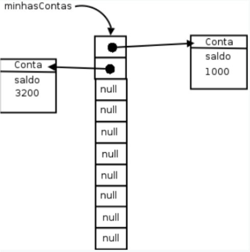
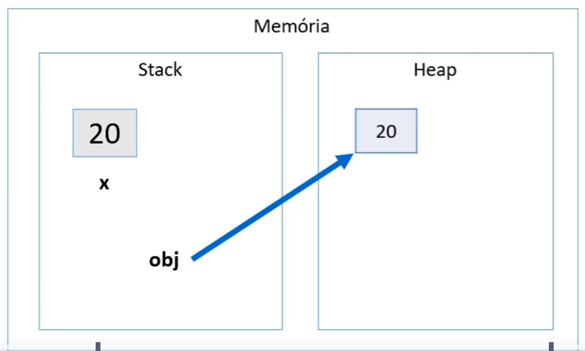
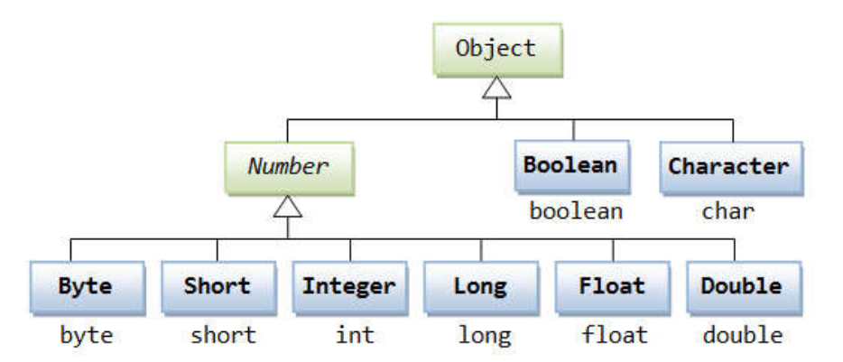
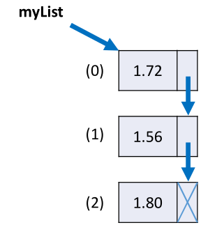

# Estrutura de dados em Java

# **Sumário**

- [1. Estrutura de Dados em Java](#1-estrutura-de-dados-em-java)
- [2. Arrays](#arrays)
  - [2.1. Motivação](#1-motivação)
  - [2.2. Declaração e Instanciação](#2-declaração-e-instanciação)
  - [2.3. Acessando Elementos](#3-acessando-elementos)
  - [2.4. Populando e Percorrendo Arrays](#4-populando-e-percorrendo-arrays)
    - [2.4.1. For Tradicional](#41-for-tradicional)
    - [2.4.2. Propriedade `length`](#42-propriedade-length)
    - [2.4.3. Enhanced `for` (Java 5+)](#43-enhanced-for-java-5)
  - [2.5. Arrays de Tipos Primitivos vs. Arrays de Objetos](#5-arrays-de-tipos-primitivos-vs-arrays-de-objetos)
    - [2.5.1. Arrays de Tipos Primitivos](#51-arrays-de-tipos-primitivos)
    - [2.5.2. Arrays de Objetos (Referências)](#52-arrays-de-objetos-referências)
  - [2.6. Arrays com Herança](#6-arrays-com-herança)
  - [2.7. Tamanho Fixo e Redimensionamento](#7-tamanho-fixo-e-redimensionamento)

- [3. Memória em Arrays de Java](#3-memória-em-arrays-de-java)
  - [3.1. Stack e Heap](#31-stack-e-heap)
  - [3.2. Organização da Memória](#32-organização-da-memória)
  - [3.3. Exemplo Visual](#33-exemplo-visual)

- [4. Boxing, Unboxing e Wrapper Classes em Java](#4-boxing-unboxing-e-wrapper-classes-em-java)
  - [4.1. Introdução](#41-introdução)
  - [4.2. Boxing](#42-boxing)
  - [4.3. Unboxing](#43-unboxing)
  - [4.4. Wrapper Classes](#44-wrapper-classes)
  - [4.5. Exemplo Prático com Boxing e Unboxing](#45-exemplo-prático-com-boxing-e-unboxing)
  - [4.6. Uso Prático em Sistemas de Informação](#46-uso-prático-em-sistemas-de-informação)
  - [4.7. Resumo](#47-resumo)

- [5. Laço `for each`](#5-laço-for-each)
  - [5.1. Introdução](#51-introdução)
  - [5.2. Sintaxe](#52-sintaxe)
  - [5.3. Diferença entre `for` tradicional e `for each`](#53-diferença-entre-for-tradicional-e-for-each)
  - [5.4. Exemplos Práticos](#54-exemplos-práticos)
  - [5.5. Quando usar o `for each`](#55-quando-usar-o-for-each)
  - [5.6. Limitações](#56-limitações)
  - [5.7. Conclusão](#57-conclusão)

- [6. Listas em Java](#6-listas-em-java)
  - [6.1. Conceito de Lista](#61-conceito-de-lista)
    - [6.1.1. Vantagens](#611-vantagens)
    - [6.1.2. Desvantagens](#612-desvantagens)
  - [6.2. Interface `List` e Implementações](#62-interface-list-e-implementações)
  - [6.3. Operações Básicas com Listas](#63-operações-básicas-com-listas)
    - [6.3.1. Inserir Elementos: `add()`](#631-inserir-elementos-add)
    - [6.3.2. Obter Tamanho: `size()`](#632-obter-tamanho-size)
    - [6.3.3. Acessar Elementos: `get(position)`](#633-acessar-elementos-getposition)
    - [6.3.4. Percorrer a Lista](#634-percorrer-a-lista)
    - [6.3.5. Remover Elementos: `remove()` e `removeIf()`](#635-remover-elementos-remove-e-removeif)
    - [6.3.6. Encontrar Posições: `indexOf()` e `lastIndexOf()`](#636-encontrar-posições-indexof-e-lastindexof)
  - [6.4. Trabalhando com Streams e Filtros](#64-trabalhando-com-streams-e-filtros)
    - [6.4.1. Filtrar Elementos com `stream()` e `filter()`](#641-filtrar-elementos-com-stream-e-filter)
    - [6.4.2. Encontrar Primeira Ocorrência com `findFirst()`](#642-encontrar-primeira-ocorrência-com-findfirst)
  - [6.5. Código Completo com Demonstração](#65-código-completo-com-demonstracao)
  - [6.6. Vantagens e Desvantagens das Listas](#66-vantagens-e-desvantagens-das-listas)
  - [6.7. Conclusão](#67-conclusão)

- [7. Matrizes em Java](#7-matrizes-em-java)
  - [7.1. O que é uma Matriz?](#71-o-que-é-uma-matriz)
    - [7.1.1. Características](#711-características)
    - [7.1.2. Exemplo Visual](#712-exemplo-visual)
  - [7.2. Declaração e Instanciação de Matrizes em Java](#72-declaração-e-instanciação-de-matrizes-em-java)
  - [7.3. Acesso aos Elementos](#73-acesso-aos-elementos)
  - [7.4. Como Percorrer uma Matriz](#74-como-percorrer-uma-matriz)
  - [7.5. Propriedade `length`](#75-propriedade-length)
  - [7.6. Exemplo Completo](#76-exemplo-completo)
  - [7.7. Vantagens e Desvantagens das Matrizes](#77-vantagens-e-desvantagens-das-matrizes)
  - [7.8. Quando usar Matrizes?](#78-quando-usar-matrizes)

---

# Arrays 

Em Java, **arrays** são estruturas homogêneas (mesmo tipo) que armazenam diversos elementos usando uma única referência. São **contíguos na memória**, de **tamanho fixo** e **indexados** a partir de 0.

<br>


---

## 1. Motivação

Sem arrays, teríamos que armazenar dados em várias variáveis separadas:
```java
double saldoConta1 = conta1.getSaldo();
double saldoConta2 = conta2.getSaldo();
double saldoConta3 = conta3.getSaldo();
```
Isso é pouco prático. Com arrays, unificamos as variáveis em uma única estrutura.

<br>

---

## 2. Declaração e Instanciação

Para usar arrays:
1. **Declarar** a variável de array, informando o tipo dos elementos.
2. **Instanciar** o objeto array, definindo quantas posições ele terá.

### Exemplo de Array de `double`
```java
double[] saldosDasContas;          // Declaração
saldosDasContas = new double[10];  // Instancia 10 posições (índices 0 a 9)
```
- `saldosDasContas` é uma **referência** a um objeto array de `double`.
- Cada posição começa com valor **0.0**.

### Acessando Elementos
```java
saldosDasContas[0] = 1000.0;
saldosDasContas[5] = 500.0;
System.out.println(saldosDasContas[5]); // 500.0
```
> **Atenção:** Índices inválidos (ex.: `saldosDasContas[10]`) geram `ArrayIndexOutOfBoundsException`.

<br>

---

## 3. Populando e Percorrendo Arrays

### 3.1 For Tradicional
Se o array tiver 10 posições, elas vão de `0` a `9`:
```java
int[] idades = new int[10];

// Atribuindo valores
for (int i = 0; i < 10; i++) {
    idades[i] = i * 10;
}

// Exibindo valores
for (int i = 0; i < 10; i++) {
    System.out.println(idades[i]);
}
```

### 3.2 Propriedade `length`
Use `array.length` para obter o tamanho do array, evitando valores “hard-coded”:
```java
for (int i = 0; i < idades.length; i++) {
    System.out.println(idades[i]);
}
```

### 3.3 Enhanced `for` (Java 5+)
Forma simplificada de iterar quando o índice não é necessário:
```java
for (int valor : idades) {
    System.out.println(valor);
}
```

<br>

---

## 4. Arrays de Tipos Primitivos vs. Arrays de Objetos

### 4.1 Arrays de Tipos Primitivos
Cada posição guarda diretamente o valor:
```java
int[] numeros = new int[3];
numeros[0] = 10;
numeros[1] = 20;
numeros[2] = 30;
```

### 4.2 Arrays de Objetos (Referências)
Cada posição armazena uma **referência** a um objeto na **Heap**. Antes de atribuir, é `null`.

```java
ContaCorrente[] minhasContas = new ContaCorrente[10];
minhasContas[0] = new ContaCorrente();
minhasContas[0].deposita(1000.0);
```
> Se tentarmos `minhasContas[1].getSaldo()` sem atribuir um objeto, ocorre `NullPointerException`.



<br>

---

## 5. Arrays com Herança
Podemos usar um array do tipo da classe-mãe (`Conta`) para armazenar subclasses:
```java
Conta[] contas = new Conta[10];
contas[0] = new ContaCorrente();
contas[1] = new ContaPoupanca();
```
Cada posição guarda uma referência que aponta para um tipo específico de `Conta`.

<br>

---

## 6. Tamanho Fixo e Redimensionamento

O tamanho do array é definido ao criar com `new`. Para “aumentar”:
1. Crie um novo array maior.
2. Copie os elementos do array antigo.
3. Atribua a nova referência.

```java
int[] numeros = new int[5];
int[] numerosMaior = new int[10];

for (int i = 0; i < numeros.length; i++) {
    numerosMaior[i] = numeros[i];
}

numeros = numerosMaior;
```
> Em muitos casos, preferimos estruturas de **coleção** (ex.: `ArrayList`, `HashSet`) que crescem dinamicamente.

<br>

---

# Memória em Arrays de Java

## 1. Stack e Heap

- **Stack:**  
  Armazena variáveis locais e referências (incluindo a referência do array e o tamanho).

- **Heap:**  
  Armazena o **array em si** (com suas posições) e os **objetos** que cada posição referência.

---

## 2. Organização da Memória

### Referências no Array


Cada posição em um array de objetos aponta para um objeto na Heap ou permanece `null`.

```java
Conta[] contas = new Conta[3];
contas[0] = new Conta();
contas[1] = new Conta();
contas[2] = null;
```
**Visão de Memória:**
- **Stack:** mantém a variável `contas` (referência ao array) e as variáveis locais.
- **Heap:** contém o array `contas` (3 posições) e os objetos `Conta`.

---

## 3. Exemplo Visual

```plaintext
Stack:                 Heap:
contas  ---------->  [Ref0, Ref1, null]
Ref0  ------------>   Objeto Conta (#1)
Ref1  ------------>   Objeto Conta (#2)
```

---

# **Boxing, Unboxing e Wrapper Classes em Java**

## **Introdução**
Em Java, existem dois tipos de dados principais:
- **Tipos primitivos:** Dados simples como `int`, `double`, `char`, `boolean`, entre outros.
- **Tipos referência:** Objetos e instâncias de classes.

Por padrão, os tipos primitivos são mais eficientes em termos de desempenho e memória, mas não oferecem os recursos da Programação Orientada a Objetos (POO). Para trabalhar com esses recursos, o Java disponibiliza as **wrapper classes**, que encapsulam tipos primitivos em objetos.

## **1. Boxing**

### **O que é?**
O **Boxing** é o processo de conversão automática de um **tipo primitivo** para o seu **tipo referência correspondente** (ou seja, uma **wrapper class**). Isso permite que tipos primitivos sejam tratados como objetos.

### **Como funciona na memória?**

- **Stack:** Armazena variáveis locais e referências.
- **Heap:** Armazena objetos e instâncias.




No exemplo acima:
- `x` (20) está armazenado na **Stack**.
- `obj` é uma referência que aponta para um objeto `Integer` armazenado na **Heap**, que contém o valor 20.


### **Quando é usado?**
- Ao adicionar tipos primitivos em coleções que aceitam apenas objetos (ex.: `ArrayList<Integer>`).
- Ao passar tipos primitivos para métodos que exigem objetos.
- Quando precisamos usar recursos da orientação a objetos com tipos primitivos.

---

## **2. Unboxing**

### **O que é?**
O **Unboxing** é o processo inverso do boxing: converte um **objeto wrapper** de volta para o seu **tipo primitivo** correspondente.


### **Como funciona na memória?**

- `obj` aponta para um objeto `Integer` na Heap com valor 20.
- `y` recebe o valor primitivo 20 da Stack.

**Representação na memória:**


### **Quando é usado?**
- Ao realizar operações aritméticas com wrapper classes.
- Ao acessar valores em coleções e atribuí-los a tipos primitivos.
- Ao passar objetos para métodos que exigem tipos primitivos.

---

## **3. Wrapper Classes**

As **wrapper classes** são classes que encapsulam tipos primitivos em objetos, permitindo que sejam usados em contextos que exigem objetos.



### **Principais Wrapper Classes em Java:**

| Tipo Primitivo | Wrapper Class |
|----------------|---------------|
| `byte`         | `Byte`        |
| `short`        | `Short`       |
| `int`          | `Integer`     |
| `long`         | `Long`        |
| `float`        | `Float`       |
| `double`       | `Double`      |
| `char`         | `Character`   |
| `boolean`      | `Boolean`     |

### **Por que usar Wrapper Classes?**

- **Trabalhar com coleções:** Coleções como `ArrayList`, `HashMap`, e outras só aceitam tipos referência, não tipos primitivos.
- **Permitir valores `null`:** Diferente dos tipos primitivos, os objetos podem ter valor `null`, útil para representar valores indefinidos.
- **Utilizar métodos úteis:** Wrapper classes oferecem métodos que facilitam conversões e manipulações.

---

## **4. Exemplo Prático: Uso de Wrapper Classes com Boxing e Unboxing**

### **Código exemplo:**
```java
public class Demo {
    public static void main(String[] args) {
        Integer x = 10;          // Boxing: int -> Integer
        int y = x * 2;           // Unboxing automático para multiplicação

        System.out.println("Valor de x (Integer): " + x);
        System.out.println("Resultado de y (int): " + y);
    }
}
```

**Saída:**
```
Valor de x (Integer): 10
Resultado de y (int): 20
```

### **Explicação:**
- `Integer x = 10;`: O valor primitivo `10` é automaticamente convertido em um objeto `Integer` (**Boxing**).
- `int y = x * 2;`: O objeto `x` é convertido de volta para o tipo primitivo `int` para realizar a multiplicação (**Unboxing**).

---

## **5. Exemplo com Classes e Uso Prático em Sistemas de Informação**

Em aplicações reais, como sistemas de cadastro ou e-commerce, é comum usar wrapper classes em atributos de classes para permitir valores nulos e aproveitar recursos da POO.

### **Exemplo com uma classe `Product`:**
```java
public class Product {
    public String name;
    public Double price;      // Wrapper permite null e métodos adicionais
    public Integer quantity;  // Wrapper usado para aceitar valores nulos

    public Product(String name, Double price, Integer quantity) {
        this.name = name;
        this.price = price;
        this.quantity = quantity;
    }

    public double totalPrice() {
        return price * quantity;  // Unboxing automático ocorre aqui
    }
}
```

### **Uso da classe:**
```java
public class DemoProduct {
    public static void main(String[] args) {
        Product p = new Product("Laptop", 1500.00, 2);
        System.out.println("Total: " + p.totalPrice());
    }
}
```

**Saída:**
```
Total: 3000.0
```

### **Por que usar `Double` e `Integer` em vez de `double` e `int`?**

- **Permitir `null`:** Se o preço ou a quantidade ainda não forem definidos, podemos atribuir `null`, algo impossível com tipos primitivos.
- **Integração com frameworks:** Bibliotecas de persistência de dados (como JPA) exigem tipos referência para mapear colunas do banco de dados que aceitam `null`.

---

## **6. Resumo**

- **Boxing:** Converte tipos primitivos em objetos (ex.: `int` → `Integer`).
- **Unboxing:** Converte objetos wrapper em tipos primitivos (ex.: `Integer` → `int`).
- **Wrapper Classes:** Permitem usar tipos primitivos como objetos, fundamentais para trabalhar com coleções, permitir `null` e utilizar métodos adicionais.

---

<br>

# **Laço "for each"**

## **Introdução**

O laço **"for each"** é uma estrutura de repetição em Java que oferece uma forma **simplificada e legível** para percorrer elementos de **coleções** e **arrays**. Ele é especialmente útil quando você deseja acessar todos os elementos de uma coleção **sem se preocupar com índices**.

## **Sintaxe**

```java
for (Tipo elemento : coleção) {
    // comandos a serem executados para cada elemento
}
```

- **Tipo:** Tipo dos elementos da coleção ou array.
- **elemento:** Nome da variável que representará cada item da coleção em cada iteração.
- **coleção:** Estrutura de dados a ser percorrida (array, `ArrayList`, `Set`, entre outros).

## **Diferença entre o `for` tradicional e o `for each`**

### **Exemplo com `for` tradicional:**

```java
String[] nomes = {"Maria", "Bob", "Alex"};

for (int i = 0; i < nomes.length; i++) {
    System.out.println(nomes[i]);
}
```

- O `for` tradicional usa um **índice** para acessar elementos.
- Você precisa gerenciar o índice `i` e verificar a condição de parada `i < nomes.length`.

---

### **Exemplo com `for each`:**

```java
String[] nomes = {"Maria", "Bob", "Alex"};

for (String nome : nomes) {
    System.out.println(nome);
}
```

- **Leitura:** "Para cada `String nome` em `nomes`, execute o bloco de código."
- Mais **limpo** e **legível**, sem necessidade de gerenciar índices.
- Menor chance de erros como **`ArrayIndexOutOfBoundsException`**.

---

## **Quando usar o `for each`?**

- Quando você precisa apenas **acessar** e **ler** os elementos de uma coleção ou array.
- Quando não é necessário modificar o conteúdo da coleção diretamente pelo índice.
- Ao trabalhar com estruturas como **arrays**, **listas (`List`)**, **conjuntos (`Set`)**, e **mapas (`Map`)** (para mapas, utiliza-se métodos específicos).

---

## **Exemplos Práticos**

### **Exemplo 1: Percorrendo um array de inteiros**

```java
int[] numeros = {1, 2, 3, 4, 5};

for (int numero : numeros) {
    System.out.println(numero);
}
```

**Saída:**
```
1
2
3
4
5
```
---

## **Limitações do `for each`**

- Não permite acessar o **índice** atual diretamente. Se precisar do índice, use o `for` tradicional.
- Não é possível **remover elementos** de uma coleção enquanto a percorre (use iteradores para isso).
- Não permite **alterar diretamente** os valores dos elementos primitivos em arrays.

---

## **Conclusão**

- O laço **`for each`** é ideal para **percorrer coleções e arrays** de forma **simples e legível**.  
- **Use o `for each`** quando não precisar de um índice ou modificar diretamente a coleção.  
- **Use o `for` tradicional** quando for necessário acessar o índice, modificar valores ou ter mais controle sobre a iteração.

---

<br>
<br>
<br>

---

# **Listas em Java**

## **1. Conceito de Lista**

Uma **lista** é uma estrutura de dados que armazena uma coleção de elementos de forma ordenada. Cada elemento ocupa uma posição específica, acessada por índices iniciando em `0`.

### **Características das listas:**
- **Homogênea:** Armazena dados do mesmo tipo.  
- **Ordenada:** Os elementos são mantidos em ordem de inserção e podem ser acessados por posições (índices).  

### Vantagens
- **Tamanho variável:** Diferente de arrays, o tamanho pode crescer ou diminuir conforme necessário.  
- **Alocação sob demanda:** Começa vazia e aloca espaço conforme elementos são adicionados.  
- **Facilidade de inserção e remoção:** Inserir ou remover elementos é mais simples em comparação a arrays.  

---

## **2. Interface `List` e Implementações**

Em Java, a **interface `List`** define o comportamento das listas. 
Não é possível instanciar o tipo List, por isso utilizamos classes que implementam a interface List, como:

- **`ArrayList`**: Melhor desempenho para acesso direto e leitura rápida.  
- **`LinkedList`**: Melhor para inserções e remoções frequentes em qualquer posição.  




Acima temos a imagem de uma lista encadeada onde cada elemento da lista possuiu um nó (nodo) que aponta para o proximo elemento da lista, até o ultimo elemento que aponta para null.


### **Exemplo de declaração e instanciação:**

```java
import java.util.List;
import java.util.ArrayList;

public class Demo {
    public static void main(String[] args) {
        List<String> nomes = new ArrayList<>();  // Criação de uma lista de Strings
    }
}
```

---

## **3. Operações Básicas com Listas**

### **3.1 Inserir elementos na lista: `add()`**

```java
List<String> list = new ArrayList<>();
list.add("Maria");  // Adiciona no final da lista
list.add("Alex");
list.add("Bob");
list.add(2, "Marco");  // Insere "Marco" na posição 2 (empurrando os demais para frente)
```

**Resultado da lista:**  
```
[Maria, Alex, Marco, Bob]
```

---

### **3.2 Obter o tamanho da lista: `size()`**

```java
System.out.println("Tamanho da lista: " + list.size());
```

**Saída:**  
```
Tamanho da lista: 4
```

---

### **3.3 Acessar elementos: `get(position)`**

```java
System.out.println("Elemento na posição 2: " + list.get(2));  // Retorna "Marco"
```

---

### **3.4 Percorrer a lista**

#### **Com `for` tradicional:**
```java
for (int i = 0; i < list.size(); i++) {
    System.out.println(list.get(i));
}
```

#### **Com `for each`:**
```java
for (String nome : list) {
    System.out.println(nome);
}
```

**Saída:**  
```
Maria
Alex
Marco
Bob
```

---

### **3.5 Remover elementos da lista:**

- **Remover por objeto:**  
```java
list.remove("Bob");  // Remove a primeira ocorrência de "Bob"
```

- **Remover por posição:**  
```java
list.remove(1);  // Remove o elemento na posição 1
```

- **Remover com condição (`removeIf`) usando lambda:**  
```java
list.removeIf(nome -> nome.charAt(0) == 'M');  // Remove nomes que começam com 'M'
```

**Lista após remoção condicional:**  
```
[Alex, Bob]
```

---

### **3.6 Encontrar posições de elementos:**

```java
System.out.println("Index de Bob: " + list.indexOf("Bob"));  // Retorna 1
System.out.println("Index de Marco: " + list.indexOf("Marco"));  // Retorna -1 (não encontrado)
```

---

## **4. Trabalhando com Streams e Filtros**

### **4.1 Filtrar elementos com `stream()` e `filter()`**

```java
List<String> result = list.stream()
                          .filter(nome -> nome.charAt(0) == 'A')
                          .collect(Collectors.toList());
```

- Cria uma nova lista apenas com elementos que começam com a letra "A".

**Saída:**  
```
Alex
```

---

### **4.2 Encontrar a primeira ocorrência com `findFirst()`**

```java
String nome = list.stream()
                  .filter(x -> x.charAt(0) == 'J')
                  .findFirst()
                  .orElse(null);

System.out.println(nome);  // Retorna null, se não encontrado
```

---

## **5. Código Completo com Demonstração**

```java
package application;

import java.util.ArrayList;
import java.util.List;
import java.util.stream.Collectors;

public class Program {
    public static void main(String[] args) {
        List<String> list = new ArrayList<>();

        list.add("Maria");
        list.add("Alex");
        list.add("Bob");
        list.add("Anna");
        list.add(2, "Marco");

        System.out.println("Tamanho da lista: " + list.size());
        for (String x : list) {
            System.out.println(x);
        }

        System.out.println("---------------------");
        list.removeIf(x -> x.charAt(0) == 'M');  // Remove nomes que começam com 'M'
        for (String x : list) {
            System.out.println(x);
        }

        System.out.println("---------------------");
        System.out.println("Index de Bob: " + list.indexOf("Bob"));
        System.out.println("Index de Marco: " + list.indexOf("Marco"));

        System.out.println("---------------------");
        List<String> result = list.stream()
                                  .filter(x -> x.charAt(0) == 'A')
                                  .collect(Collectors.toList());
        for (String x : result) {
            System.out.println(x);
        }

        System.out.println("---------------------");
        String nome = list.stream()
                          .filter(x -> x.charAt(0) == 'J')
                          .findFirst()
                          .orElse(null);
        System.out.println(nome);  // Retorna null se não encontrar
    }
}
```

### **Saída esperada:**

```
Tamanho da lista: 5
Maria
Alex
Marco
Bob
Anna
---------------------
Alex
Bob
Anna
---------------------
Index de Bob: 2
Index de Marco: -1
---------------------
Alex
Anna
---------------------
null
```

---

## **6. Vantagens e Desvantagens das Listas**

### **Vantagens:**
- **Tamanho dinâmico:** Cresce ou diminui conforme necessário.
- **Facilidade de inserção e remoção:** Métodos como `add()`, `remove()` tornam a manipulação simples.
- **Integração com Streams:** Permite uso de funções de alto nível como `filter()`, `map()`, etc.

### **Desvantagens:**
- **Acesso sequencial:** Algumas implementações como `LinkedList` têm acesso mais lento por índice.
- **Consumo de memória:** Maior do que arrays simples.

---

## **Conclusão**

- O tipo `List` em Java é fundamental para armazenar e manipular coleções de dados de forma ordenada e flexível.  
- O uso de métodos como `add()`, `remove()`, `size()`, e recursos como **Streams** e **lambda expressions** permite manipulações poderosas e eficientes.  
- **Escolha a implementação certa:**  
  - Use **`ArrayList`** quando precisar de acesso rápido e leituras frequentes.  
  - Use **`LinkedList`** quando inserções e remoções forem mais frequentes.

---

# **Matrizes em Java**

## **1. O que é uma Matriz?**

Em programação, uma **matriz** é uma **estrutura de dados bidimensional** (também conhecida como "vetor de vetores"). Ela é usada para armazenar informações em formato de **tabela**, com **linhas** e **colunas**.

### **Características de uma matriz:**
- **Homogênea:** Todos os elementos são do mesmo tipo.  
- **Ordenada:** Os elementos são organizados e acessados através de índices.  
- **Acesso rápido:** É possível acessar diretamente qualquer elemento informando sua posição.  
- **Alocação contígua:** Toda a matriz é alocada em um bloco contínuo de memória.  

### **Exemplo visual de matriz (3 linhas x 4 colunas):**

|     | 0    | 1    | 2    | 3    |
|-----|------|------|------|------|
| 0   | 3.5  | 17.0 | 12.3 | 8.2  |
| 1   | 4.1  | 6.2  | 7.5  | 2.9  |
| 2   | 11.0 | 9.5  | 14.8 | 21.7 |

Para acessar o valor `7.5`, utilizamos o índice da linha e da coluna: `matriz[1][2]`.

---

<br>

## **2. Declaração e Instanciação de Matrizes em Java**

Para utilizar matrizes em Java, é necessário **declarar** e **instanciar** a matriz.

### **Sintaxe geral:**
```java
tipo[][] nomeDaMatriz = new tipo[numLinhas][numColunas];
```

- **tipo:** Tipo dos elementos da matriz (ex.: `int`, `double`, `String`).  
- **nomeDaMatriz:** Nome dado à matriz.  
- **numLinhas:** Quantidade de linhas.  
- **numColunas:** Quantidade de colunas.  

### **Exemplo com números `double`:**
```java
double[][] matriz = new double[3][4];  // Cria uma matriz com 3 linhas e 4 colunas
```

No momento da criação:
- Tipos numéricos (`int`, `double`) são inicializados com `0` ou `0.0`.  
- Tipos `boolean` são inicializados com `false`.  
- Tipos referência (ex.: `String`) são inicializados com `null`.  

---

<br>

## **3. Acesso aos Elementos**

Para acessar ou atribuir valores em uma matriz, utiliza-se **dois índices**:  

```java
matriz[linha][coluna]
```

### **Exemplo de atribuição:**
```java
matriz[0][0] = 3.5;
matriz[1][2] = 7.5;
```

### **Exemplo de leitura:**
```java
System.out.println(matriz[1][2]);  // Exibe: 7.5
```

---

<br>

## **4. Como Percorrer uma Matriz**

Para percorrer uma matriz e acessar todos os elementos, geralmente utilizamos **laços `for` aninhados**:

- **Laço externo:** Percorre as **linhas**.  
- **Laço interno:** Percorre as **colunas**.  

### **Exemplo de percorrimento:**
```java
for (int i = 0; i < matriz.length; i++) {  // Percorre as linhas
    for (int j = 0; j < matriz[i].length; j++) {  // Percorre as colunas
        System.out.print(matriz[i][j] + " ");
    }
    System.out.println();  // Quebra de linha para formatação
}
```

---

## **5. Propriedade `length`**

Em Java, a matriz possui a propriedade `length` para identificar:
- **Número de linhas:** `matriz.length`  
- **Número de colunas em uma linha:** `matriz[i].length`  

### **Exemplo:**
```java
System.out.println("Linhas: " + matriz.length);           // Número de linhas
System.out.println("Colunas na primeira linha: " + matriz[0].length);  // Número de colunas
```

---

<br>

## **6. Exemplo Completo**

```java
package application;

public class MatrizesDemo {
    public static void main(String[] args) {
        double[][] matriz = new double[3][4];

        // Preenchendo a matriz com valores
        matriz[0][0] = 3.5;  matriz[0][1] = 17.0;  matriz[0][2] = 12.3;  matriz[0][3] = 8.2;
        matriz[1][0] = 4.1;  matriz[1][1] = 6.2;   matriz[1][2] = 7.5;   matriz[1][3] = 2.9;
        matriz[2][0] = 11.0; matriz[2][1] = 9.5;   matriz[2][2] = 14.8;  matriz[2][3] = 21.7;

        // Exibindo a matriz
        for (int i = 0; i < matriz.length; i++) {
            for (int j = 0; j < matriz[i].length; j++) {
                System.out.print(matriz[i][j] + "\t");
            }
            System.out.println();
        }
    }
}
```

### **Saída esperada:**
```
3.5	17.0	12.3	8.2	
4.1	6.2	7.5	2.9	
11.0	9.5	14.8	21.7	
```

---

<br>

## **7. Vantagens e Desvantagens das Matrizes**

### **Vantagens:**
- **Acesso rápido:** Permite acesso direto e eficiente aos elementos pela posição.  
- **Organização:** Ideal para representar tabelas, grades e matrizes matemáticas.  

### **Desvantagens:**
- **Tamanho fixo:** O tamanho deve ser definido no momento da criação.  
- **Dificuldade de inserção/remoção:** Inserir ou remover elementos exige recriar a matriz.  
- **Uso de memória:** Matrizes muito grandes podem consumir muita memória.  

---

## **8. Quando usar matrizes?**

Use matrizes quando:  
- Precisa representar dados em **formato de tabela** (ex.: notas de alunos, mapas de jogos).  
- Precisa de **acesso rápido** aos dados por posição.  
- Os dados possuem **dimensão fixa** e conhecida previamente.  

---